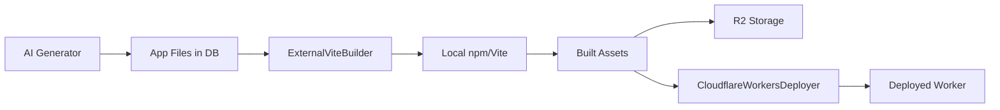

# OverSkill Build Architecture Analysis & Recommendations

## Executive Summary

This document analyzes OverSkill's current build and deployment architecture (V4) and explores alternatives for eliminating local Node.js/Vite execution while maintaining the ability to build and deploy React/TypeScript applications to Cloudflare Workers.

**Key Finding**: The current V4 architecture using local Vite builds + Cloudflare API deployment is actually optimal given Cloudflare's limitations. However, AWS Lambda presents a compelling alternative for remote builds.

## Current Architecture (V4)

### Components Overview



### 1. ExternalViteBuilder Service

**Location**: `app/services/deployment/external_vite_builder.rb`

**Key Responsibilities**:
- Creates temporary directory structure from database files
- Executes `npm install` and `vite build` locally
- Implements hybrid asset strategy (R2 for large assets)
- Returns bundled JavaScript/CSS/HTML

**Process Flow**:
1. **File Preparation** (Lines 188-197)
   - Writes app files from database to temp directory
   - Creates/updates package.json with build scripts

2. **Build Execution** (Lines 285-338)
   - Runs `npm install` with error handling
   - Sets Vite environment variables (VITE_APP_ID, etc.)
   - Executes `npm run build` or `npm run build:preview`
   - Captures stdout/stderr for debugging

3. **Asset Processing** (Lines 22-85)
   - Separates large assets (>50KB) for R2 upload
   - Keeps HTML/JS/CSS in Worker bundle
   - Implements content-type detection

4. **Worker Generation** (Lines 554-706)
   - Creates Cloudflare Worker script
   - Embeds HTML with environment variable injection
   - Serves JS assets with correct MIME types
   - Includes health check endpoints

### 2. DeployAppJob

**Location**: `app/jobs/deploy_app_job.rb`

**Key Responsibilities**:
- Orchestrates the entire deployment pipeline
- Broadcasts real-time progress updates
- Handles preview vs production deployments
- Creates versioned snapshots

**Process Flow**:
1. **Build Phase** (Lines 39-56)
   - Calls ExternalViteBuilder.build_for_preview_with_r2
   - Handles build failures gracefully

2. **Deployment Phase** (Lines 71-99)
   - Uses CloudflareWorkersDeployer
   - Maps environment to deployment type
   - Deploys with secrets management

3. **Post-Deployment** (Lines 121-149)
   - Updates app URLs (preview/production)
   - Creates app version with snapshot
   - Broadcasts success to UI

### Current Build Requirements

- **Local Node.js**: Required for npm/Vite execution
- **Temp Storage**: ~100-500MB per build
- **Build Time**: 45s (dev) to 3min (production)
- **Memory**: 512MB-1GB during builds
- **Dependencies**: Node 18+, npm, Vite, TypeScript

## Cloudflare API Capabilities & Limitations

### What Cloudflare CAN Do

✅ **Via REST API**:
- Upload pre-built Worker scripts
- Manage environment variables/secrets
- Configure custom routes
- Deploy to preview/production
- Manage R2 assets
- Version control and rollbacks

### What Cloudflare CANNOT Do

❌ **Not Available**:
- Remote npm install execution
- Vite/webpack builds in Workers
- Node.js build tooling
- Dynamic dependency resolution
- Build-time TypeScript compilation

### Why Cloudflare Can't Build

1. **Worker Runtime Limitations**:
   - 128MB memory limit
   - 10ms CPU time limit (50ms paid)
   - No filesystem access
   - No child process spawning

2. **Architecture Mismatch**:
   - Workers designed for request handling, not build tooling
   - No npm/node_modules support
   - No build cache or persistent storage

3. **API Design**:
   - Script upload API expects bundled JavaScript
   - No build pipeline API endpoints
   - Git-based builds require repository integration

## Alternative Solutions Analysis

### Option 1: AWS Lambda (RECOMMENDED)

**Implementation Architecture**:
```ruby
class Deployment::LambdaBuildService
  def execute_build(app)
    # 1. Package source files
    zip_buffer = package_files(app.app_files)
    
    # 2. Upload to S3
    s3_key = upload_to_s3(zip_buffer)
    
    # 3. Invoke Lambda
    response = lambda_client.invoke(
      function_name: 'overskill-vite-builder',
      payload: {
        source_bucket: 'overskill-builds',
        source_key: s3_key,
        build_commands: [
          'npm install',
          'npm run build'
        ]
      }.to_json
    )
    
    # 4. Download built assets
    download_built_assets(response['output_key'])
  end
end
```

**Lambda Function Setup**:
```javascript
// Lambda handler for Vite builds
exports.handler = async (event) => {
  const { source_bucket, source_key, build_commands } = event;
  
  // 1. Download source files from S3
  await downloadFromS3(source_bucket, source_key, '/tmp/build');
  
  // 2. Execute build commands
  for (const command of build_commands) {
    await execPromise(command, { cwd: '/tmp/build' });
  }
  
  // 3. Upload built assets back to S3
  const outputKey = await uploadToS3('/tmp/build/dist');
  
  return { success: true, output_key: outputKey };
};
```

**Advantages**:
- ✅ Native Node.js 20 runtime
- ✅ 15-minute timeout (sufficient for builds)
- ✅ 10GB memory available
- ✅ Pay-per-use pricing (~$0.30/month for 100 builds)
- ✅ Direct integration with S3 for asset storage
- ✅ CloudWatch logs for debugging

**Disadvantages**:
- ❌ Additional AWS infrastructure required
- ❌ Cross-cloud complexity (AWS + Cloudflare)
- ❌ Cold starts may add 1-2s latency

### Option 2: GitHub Actions API

**Implementation**:
```ruby
class Deployment::GitHubActionsBuildService
  def trigger_build(app)
    # 1. Create temporary branch with app files
    create_branch_with_files(app)
    
    # 2. Trigger workflow via API
    octokit.create_workflow_dispatch(
      'overskill/build-repo',
      'vite-build.yml',
      'main',
      inputs: {
        app_id: app.id,
        environment: 'preview'
      }
    )
    
    # 3. Poll for completion
    wait_for_workflow_completion
    
    # 4. Download artifacts
    download_workflow_artifacts
  end
end
```

**GitHub Action Workflow**:
```yaml
name: Vite Build
on:
  workflow_dispatch:
    inputs:
      app_id:
        required: true

jobs:
  build:
    runs-on: ubuntu-latest
    steps:
      - uses: actions/checkout@v4
      - uses: actions/setup-node@v4
        with:
          node-version: '20'
      - run: npm install
      - run: npm run build
      - uses: actions/upload-artifact@v4
        with:
          name: built-app-${{ github.event.inputs.app_id }}
          path: dist/
```

**Advantages**:
- ✅ Free tier includes 2,000 minutes/month
- ✅ Familiar CI/CD environment
- ✅ Built-in artifact storage
- ✅ Excellent for open-source visibility

**Disadvantages**:
- ❌ Requires Git repository management
- ❌ Higher latency (git operations)
- ❌ More complex error handling

### Option 3: Docker-based Solutions

**AWS Fargate**:
```ruby
class Deployment::FargateBuildService
  def run_build(app)
    # Run containerized build on Fargate
    ecs_client.run_task(
      cluster: 'overskill-builds',
      task_definition: 'vite-builder:latest',
      overrides: {
        container_overrides: [{
          name: 'builder',
          environment: [
            { name: 'APP_ID', value: app.id.to_s }
          ]
        }]
      }
    )
  end
end
```

**Advantages**:
- ✅ Full container control
- ✅ Can cache node_modules
- ✅ Scalable to any size

**Disadvantages**:
- ❌ Higher cost (~$10-20/month minimum)
- ❌ Complex orchestration
- ❌ Slower startup times

### Option 4: Keep Current Architecture (Optimized)

**Improvements to Current System**:
```ruby
class Deployment::OptimizedViteBuilder < ExternalViteBuilder
  def initialize(app)
    super
    @cache_dir = Rails.root.join('tmp', 'build_cache', "app_#{app.id}")
  end
  
  def build_with_cache
    # 1. Reuse node_modules if unchanged
    restore_node_modules_cache if package_json_unchanged?
    
    # 2. Use Vite's built-in caching
    ENV['VITE_CACHE_DIR'] = @cache_dir.join('.vite').to_s
    
    # 3. Incremental builds for small changes
    if incremental_change?
      build_incremental
    else
      build_full
    end
  end
  
  private
  
  def package_json_unchanged?
    cached_hash = @cache_dir.join('.package_hash').read rescue nil
    current_hash = Digest::SHA256.hexdigest(package_json_content)
    cached_hash == current_hash
  end
end
```

**Advantages**:
- ✅ No external dependencies
- ✅ Full control over build process
- ✅ Fastest possible builds (local)
- ✅ Easiest to debug

**Disadvantages**:
- ❌ Requires Node.js on Rails servers
- ❌ Security considerations (npm packages)
- ❌ Scaling requires more servers

## Cost Comparison (100 builds/month)

| Solution | Monthly Cost | Build Time | Complexity |
|----------|-------------|------------|------------|
| Current (Local) | $0 (server overhead) | 45s-3min | Low |
| AWS Lambda | ~$0.30 | 2-5min | Medium |
| GitHub Actions | $0-10 | 3-5min | Medium |
| AWS Fargate | $10-20 | 2-4min | High |
| Vercel API | $1-5 | 1-3min | Low |

## Recommendations

### Short Term (Immediate)
1. **Keep current V4 architecture** - It's working well and is cost-effective
2. **Optimize with caching** - Implement node_modules and Vite caching
3. **Add monitoring** - Track build times and failure rates

### Medium Term (3-6 months)
1. **Implement AWS Lambda** as alternative build pipeline
2. **A/B test** Lambda vs local builds for performance
3. **Create fallback** system for build failures

### Long Term (6+ months)
1. **Evaluate Vercel's v0 Platform API** when stable
2. **Consider hybrid** approach: simple builds local, complex in Lambda
3. **Explore WebAssembly** builds for true edge compilation (future)

### Recommended Implementation Path

```ruby
# 1. Create build service interface
class Deployment::BuildService
  def self.for(app)
    case Rails.configuration.build_mode
    when :lambda
      LambdaBuildService.new(app)
    when :github
      GitHubActionsBuildService.new(app)
    else
      ExternalViteBuilder.new(app)  # Current default
    end
  end
end

# 2. Gradual migration
class DeployAppJob
  def perform(app_id, environment = "production")
    app = App.find(app_id)
    
    # Use appropriate builder based on app complexity
    builder = if app.complex_build?
      Deployment::LambdaBuildService.new(app)
    else
      Deployment::ExternalViteBuilder.new(app)
    end
    
    result = builder.build_for_preview_with_r2
    # ... rest of deployment
  end
end
```

## Conclusion

While Cloudflare doesn't provide build capabilities via API, the current V4 architecture is actually well-designed for the constraints. AWS Lambda offers the most promising alternative for eliminating local Node.js execution while maintaining cost-effectiveness and simplicity.

The hybrid approach of using external builds (whether local or Lambda) combined with Cloudflare's excellent edge deployment remains the optimal solution for OverSkill's use case.

## Action Items

1. ✅ Document current architecture (this document)
2. 🔄 Implement build caching in ExternalViteBuilder
3. 📊 Add build metrics collection
4. 🚀 Prototype AWS Lambda builder
5. 📈 Monitor and compare performance
6. 🔄 Evaluate and iterate based on data