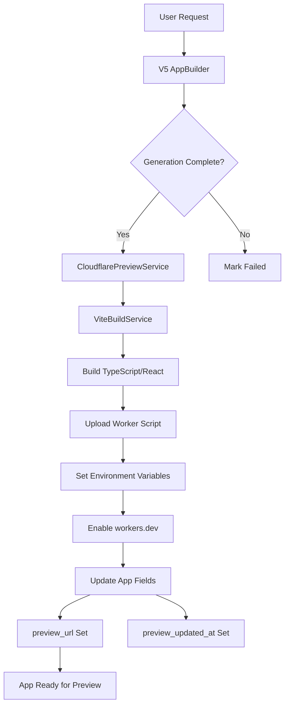

# OverSkill Deployment Architecture & Version Preview URLs

## Current Deployment Flow



## Database Fields & Timing

### App Model Fields
```ruby
# Preview/Deployment URLs
preview_url         # Set when preview deployed (e.g., https://preview-UUID.overskill.app)
production_url      # Set when published to production  
deployment_url      # Alternative production URL field
staging_url         # For staging environment

# Timestamps
preview_updated_at  # When preview was last deployed
deployed_at         # When production was deployed
staging_deployed_at # When staging was deployed

# Status
status              # generating -> ready -> published
deployment_status   # pending -> deploying -> deployed -> failed
```

### AppVersion Model Fields
```ruby
# Version tracking
version_number      # e.g., "1.0.0"
display_name        # AI-generated summary
deployed            # Boolean flag
published_at        # When made public
environment         # preview/staging/production

# NO preview_url field currently exists for versions!
```

## Current Deployment Environments

### 1. Preview (Auto-Deploy)
- **Worker Name**: `preview-{app.id}`
- **URL Pattern**: 
  - Custom: `https://preview-{app.id}.overskill.app`
  - Workers.dev: `https://preview-{app.id}.{account-id}.workers.dev`
- **When**: After AI generation completes
- **Updates**: `app.preview_url`, `app.preview_updated_at`

### 2. Staging
- **Worker Name**: `staging-{app.id}`
- **URL Pattern**: `https://preview--{app.subdomain}.overskill.app`
- **When**: Manual deployment for testing
- **Updates**: `app.staging_url`, `app.staging_deployed_at`

### 3. Production
- **Worker Name**: `production-{app.id}`
- **URL Pattern**: `https://{app.subdomain}.overskill.app`
- **When**: App published
- **Updates**: `app.production_url`, `app.deployed_at`

## Cloudflare Workers Preview URLs

### Native Cloudflare Features

1. **Workers.dev Subdomain**
   - Format: `https://{worker-name}.{account-subdomain}.workers.dev`
   - Always available for any deployed worker
   - Free, no custom domain needed
   - Example: `https://production-483.todd-e03.workers.dev`

2. **Preview URLs (Inactive)**
   - Cloudflare has a "Preview URLs" feature but it's marked "Inactive" in dashboard
   - Appears to be for branch deployments with Wrangler CLI
   - Format: `*-{worker-name}.{account}.workers.dev`

3. **Custom Routes**
   - Pattern-based routing: `*.overskill.app/*`
   - Can map multiple workers to different subdomains
   - Requires custom domain in Cloudflare

## Version Preview Implementation Options

### Option 1: Dedicated Worker Per Version (Recommended) 🌟
```ruby
# Deploy each version as a separate worker
worker_name = "version-#{app.id}-#{version.id}"
url = "https://version-#{app.id}-#{version.id}.#{account}.workers.dev"

# Benefits:
# - True isolation between versions
# - Can preview exact state at any point
# - No file switching logic needed
# - Parallel deployment possible

# Implementation:
class AppVersion < ApplicationRecord
  # Add new fields via migration
  # t.string :preview_worker_name
  # t.string :preview_url
  # t.datetime :preview_deployed_at
  
  def deploy_preview!
    service = Deployment::VersionPreviewService.new(self)
    result = service.deploy_version_worker!
    
    if result[:success]
      update!(
        preview_worker_name: result[:worker_name],
        preview_url: result[:preview_url],
        preview_deployed_at: Time.current
      )
    end
  end
end
```

### Option 2: Single Worker with Version Routing
```javascript
// Worker script handles version switching
addEventListener('fetch', event => {
  const url = new URL(event.request.url)
  const versionId = url.searchParams.get('version')
  
  if (versionId) {
    // Fetch and serve files for specific version
    event.respondWith(serveVersion(versionId))
  } else {
    // Serve latest version
    event.respondWith(serveLatest())
  }
})

// Benefits:
// - Single worker to manage
// - Lower Cloudflare worker count
// - Simpler deployment

// Drawbacks:
// - Complex file switching logic
// - Potential performance issues
// - Version files must be stored somewhere (KV, R2)
```

### Option 3: Hybrid Approach (Best Balance) ✅
```ruby
# Keep last 3-5 versions as active workers
# Archive older versions to R2/database

class VersionDeploymentStrategy
  MAX_ACTIVE_VERSIONS = 5
  
  def deploy_version(version)
    if should_deploy_as_worker?(version)
      deploy_as_worker(version)
    else
      archive_to_storage(version)
    end
    
    cleanup_old_workers if active_workers_count > MAX_ACTIVE_VERSIONS
  end
  
  private
  
  def should_deploy_as_worker?(version)
    # Deploy if:
    # - It's bookmarked
    # - It's recent (last 5 versions)
    # - It's the production version
    version.bookmarked? || 
    recent_version?(version) || 
    version.deployed?
  end
end
```

## Implementation Recommendations

### 1. Database Schema Changes
```ruby
# Migration: add_preview_urls_to_app_versions
class AddPreviewUrlsToAppVersions < ActiveRecord::Migration[7.0]
  def change
    add_column :app_versions, :preview_worker_name, :string
    add_column :app_versions, :preview_url, :string
    add_column :app_versions, :preview_deployed_at, :datetime
    add_column :app_versions, :preview_status, :string, default: 'pending'
    
    add_index :app_versions, :preview_worker_name
    add_index :app_versions, :preview_url
    add_index :app_versions, :preview_status
  end
end
```

### 2. New Service Class
```ruby
# app/services/deployment/version_preview_service.rb
module Deployment
  class VersionPreviewService < CloudflarePreviewService
    def initialize(app_version)
      @version = app_version
      @app = app_version.app
      super(@app)
    end
    
    def deploy_version_preview!
      worker_name = "version-#{@app.id}-#{@version.id}"
      
      # Build with version's files
      files = build_version_files
      worker_script = generate_worker_script_with_built_files(files)
      
      # Deploy to Cloudflare
      upload_response = upload_worker(worker_name, worker_script)
      enable_workers_dev_subdomain(worker_name)
      
      # Return preview URL
      {
        success: true,
        worker_name: worker_name,
        preview_url: "https://#{worker_name}.#{@account_id.gsub('_', '-')}.workers.dev"
      }
    end
    
    private
    
    def build_version_files
      # Reconstruct files at this version point
      files = {}
      @version.app_version_files.includes(:app_file).each do |vf|
        next if vf.action == 'deleted'
        files[vf.app_file.path] = {
          content: vf.app_file.content,
          content_type: get_content_type(vf.app_file.path)
        }
      end
      files
    end
  end
end
```

### 3. UI Integration
```erb
<!-- app/views/account/app_versions/_version_row.html.erb -->
<div class="version-actions">
  <% if version.preview_url.present? %>
    <%= link_to version.preview_url, 
        target: "_blank", 
        class: "btn btn-sm btn-primary",
        data: { turbo: false } do %>
      <i class="fas fa-external-link-alt"></i> Preview
    <% end %>
  <% else %>
    <%= button_to "Deploy Preview",
        deploy_preview_app_version_path(version),
        method: :post,
        class: "btn btn-sm btn-secondary",
        data: { 
          turbo_stream: true,
          controller: "loading-button"
        } %>
  <% end %>
</div>
```

### 4. Preview Frame Updates
```javascript
// Update version_preview_controller.js
async previewVersion(versionId) {
  // First, check if version has its own preview URL
  const response = await fetch(`/account/app_versions/${versionId}.json`)
  const version = await response.json()
  
  if (version.preview_url) {
    // Use dedicated version preview URL
    this.iframeTarget.src = version.preview_url
  } else {
    // Trigger deployment or use fallback
    await this.deployVersionPreview(versionId)
  }
}

async deployVersionPreview(versionId) {
  const response = await fetch(`/account/app_versions/${versionId}/deploy_preview`, {
    method: 'POST',
    headers: {
      'X-CSRF-Token': document.querySelector('[name="csrf-token"]').content
    }
  })
  
  if (response.ok) {
    const result = await response.json()
    this.iframeTarget.src = result.preview_url
  }
}
```

## Cost & Performance Considerations

### Cloudflare Limits
- **Free Plan**: 100,000 requests/day, 10ms CPU time
- **Paid Plan**: 10 million requests/month included
- **Worker Count**: No hard limit, but management overhead
- **Worker Size**: 1MB compressed (after gzip)

### Optimization Strategies
1. **Lazy Deployment**: Only deploy version previews when requested
2. **TTL Management**: Auto-remove preview workers after 7 days of inactivity
3. **Shared Assets**: Use R2 for common assets across versions
4. **Smart Caching**: Cache built files in Cloudflare KV for faster rebuilds

## Next Steps

### Phase 1: MVP Implementation (1-2 days)
1. ✅ Add preview_url fields to app_versions table
2. ✅ Create VersionPreviewService class
3. ✅ Add "Deploy Preview" button to version rows
4. ✅ Update version_preview_controller.js

### Phase 2: Optimization (3-5 days)
1. Implement worker lifecycle management
2. Add automatic cleanup of old preview workers
3. Implement caching strategy for faster deployments
4. Add preview URL expiration/TTL

### Phase 3: Advanced Features (1 week)
1. Version comparison view (side-by-side previews)
2. Branch deployments for collaborative editing
3. Preview URL sharing with temporary access tokens
4. Analytics per version preview

## Questions for Decision

1. **Worker Naming Convention**: Should we use UUIDs or sequential IDs?
   - `version-{app_id}-{version_id}` (readable)
   - `v-{uuid}` (shorter, more secure)

2. **Retention Policy**: How long to keep version preview workers?
   - 7 days for non-bookmarked
   - 30 days for bookmarked
   - Forever for production deployments

3. **Access Control**: Should version previews be public or require auth?
   - Public with obfuscated URLs
   - Protected with Cloudflare Access
   - Token-based temporary access

## Recommended Approach

**Go with Option 3 (Hybrid Approach)** because it:
- Provides instant preview for recent versions
- Manages Cloudflare worker count efficiently  
- Allows bookmarking important versions
- Scales well with app growth
- Balances cost and performance

The implementation would involve:
1. Adding preview URL fields to AppVersion model
2. Creating VersionPreviewService extending existing CloudflarePreviewService
3. Implementing smart deployment strategy (recent + bookmarked)
4. Adding UI controls for deploying/viewing version previews
5. Setting up automatic cleanup for old preview workers

This gives you **instant version switching** in the UI while maintaining reasonable infrastructure costs.