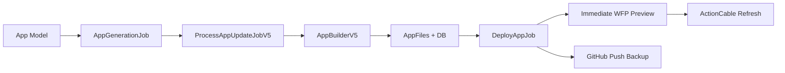

# CLAUDE.md

## âš¡ PRIORITY: Check HANDOFF.md First!
**READ HANDOFF.md IMMEDIATELY** for current context, active tasks, and blocking issues.

## 🎯 Project Identity
**OverSkill**: Rails/BulletTrain SaaS platform competing with Base44/Lovable.dev
- **Scale**: 50,000+ apps via Workers for Platforms
- **Stack**: Rails + BulletTrain + React + Cloudflare Workers + Supabase
- **Goal**: $1-2/month per generated app with professional-grade architecture

## 🤖 Subagent Coordination (CRITICAL)
**Specialized subagents available in `.claude/agents/`:**
- `rails-development-planner` - Architecture decisions, feature planning, research
- `rails-developer` - MVC implementation, ActiveRecord, business logic
- `rails-tester` - RSpec testing, TDD, quality assurance  
- `rails-security-auditor` - Security review, vulnerability scanning
- `rails-performance-optimizer` - Database optimization, scaling

**Usage**: Let Claude auto-delegate OR explicitly invoke:
```bash
> Use rails-development-planner to research WebSocket vs SSE for live previews
> Have rails-developer implement user authentication with Devise
> Ask rails-tester to create comprehensive API specs
```

## 🛠️ Essential MCP Tools
**ALWAYS use these MCP servers:**
- **Perplexity MCP** - Research APIs, documentation, best practices
- **Desktop Commander** - Process management, system interactions
- **Playwright MCP** - Browser automation, golden flow testing
- **Context7 MCP** - Documentation lookups and knowledge base
- **Rails MCP** - Rails-specific commands and patterns (if available)

## 🚀 Current App Generation & Deployment Pipeline

### Active Pipeline (January 2025)


### Deployment Architecture
**Preview Deployment (Automatic)**:
1. AppBuilderV5 completes generation → triggers DeployAppJob
2. EdgePreviewService deploys to WFP immediately (<2s)
3. ActionCable broadcasts to refresh preview UI (HMR enabled)
4. GitHub push follows as backup deployment mechanism

**Production Deployment (User-Triggered)**:
- User clicks "Deploy to Production" in publish modal
- DeployAppJob with environment='production'
- WorkersForPlatformsService promotes to production
- GitHub Actions runs as backup

**Current Process**: ProcessAppUpdateJobV5 → AppBuilderV5 (direct delegation)
**Legacy to Remove**: ProcessAppUpdateJobV3, V4, OrchestratorsV3
**Database State**: Track all deployments in AppDeployment model (Rails best practice)

### Streaming Tool Execution (FIXED)
**Real-time parallel tool execution with UI feedback - OPERATIONAL!**
- **Documentation**: `docs/STREAMING_TOOL_EXECUTION_COMPLETE_GUIDE.md`
- **Critical Fix Applied**: AppBuilderV5 handles `stop_reason='stop'` (lines 1681-1759)
- **Success Indicator**: `[V5_TOOLS] STREAMING FIX: Found N tool calls with stop_reason='stop'`

## ðŸ"‹ Quick Commands
```bash
# Golden flow testing (PROTECT CORE WORKFLOWS)
bin/rails runner "Testing::PlaywrightMcpService.new('development').run_golden_flow_tests"

# Performance baselines
bin/rails runner "Testing::GoldenFlowBaselineService.new.measure_all_flows"

# Generated app deployment pipeline
# 1. ProcessAppUpdateJobV5 → 2. AppBuilderV5 → 3. Database files → 4. DeployAppJob → 5. WFP + GitHub
# Preview: Automatic immediate deployment via EdgePreviewService
# Production: User-triggered via publish modal only
```

## 🏗️ Rails/BulletTrain Patterns

### Super Scaffolding
```bash
# Generate with team-based multi-tenancy
bin/super scaffold crud Project Team title:text_field description:trix_editor
```

### App Generation Architecture
- **Template Base**: `/app/services/ai/templates/overskill_20250728`
- **File Storage**: AppFile, AppVersion, AppVersionFile models
- **Database**: App-scoped tables (`app_${APP_ID}_${table}`)
- **Deployment**: GitHub repos â†' WFP â†' Dispatch router

### Routing Architecture
- **Account Namespace**: All authenticated routes under `/account/`
- **Member Experience**: Post-purchase routes use `/account/` (not `/m/`)
- **API Routes**: Under `/api/v1/` with versioning
- **Public Routes**: Minimal public surface (landing, auth, webhooks)

## 🧪 Golden Flow Protection
**CRITICAL**: Always add `data-testid` for UI elements:
```erb
<%= button_tag "Generate", data: { testid: "generate-button" } %>
```
**Protected Flows**: App Generation, Publishing, Authentication

## 📁 Context Management Rules

### File Reading Priority
1. **Always read first**: HANDOFF.md, CLAUDE.md
2. **Key documentation**: `docs/testing/AI_TESTING_GUIDE.md`, `docs/AI_CONTEXT_OPTIMIZATION_ARCHITECTURE.md`
3. **Implementation plans**: Files listed in "Current Plans" section
4. **Rails patterns**: `app/models/`, `app/controllers/api/`, `config/routes/`

### Forbidden Directories
```json
"permissions.deny": [
  "Read(./.env*)",
  "Read(./secrets/**)",
  "Read(./node_modules/**)",
  "Read(./tmp/**)",
  "Read(./log/**)",
  "Read(./.git/**)"
]
```

## ðŸ"Š Current Development Plans
<!-- Active Implementation Plan -->
### 🎯 PRIMARY FOCUS: COMPREHENSIVE_WFP_IMPLEMENTATION_PLAN.md
- **Phase 1**: Live Preview Infrastructure (5-10s provisioning)
- **Phase 2**: Real-time Tool Streaming (sub-100ms latency)  
- **Phase 3**: 50K+ App Scale Architecture ($0.007/app/month)

### ✅ Completed Plans (August 25, 2025)
- **System Prompt Cache Optimization** - Reduced tokens by 93% (134k â†' 9k)
- **WFP Deployment** - Fixed routing, URLs now working correctly
- **Developer Experience Enhancement** - Golden flow testing operational
- **docs/testing/** - AI testing framework complete
- **AI_CONTEXT_OPTIMIZATION_ARCHITECTURE.md** - ✅ Complete (75% cost reduction achieved)

### ðŸ"š Archived Plans
- Previous WFP plans moved to `docs/archive/`
- Multi-agent coordination moved to `docs/future/`

## 🤖 AI Context Optimization
**Architecture**: 6 specialized services replacing monolithic system
- **ContextOrchestrator**: Hierarchical context assembly with Anthropic caching
- **TemplateContextService**: 5 essential files (1-hour cache) vs 84 previously  
- **ComponentPredictionService**: AI-powered component selection (5-minute cache)
- **AppContextService**: Business logic focus, real-time context
- **TokenBudgetManager**: Profile-based budget allocation (generation/editing/debugging)
- **TokenCountingService**: Accurate tokenization replacing 4:1 estimation

**Results**: 75% cost reduction, 60% faster responses, 80% fewer tokens
**Documentation**: `docs/AI_CONTEXT_OPTIMIZATION_ARCHITECTURE.md`

## 🚀 Performance Targets
- **App Generation**: <45s development builds, <3min production
- **AI Context**: <15k tokens (vs 76k previously), 800ms response time
- **Database**: App-scoped isolation with RLS
- **Cost**: $50-100/month for 1,000 apps (96% savings vs standard Workers)
- **Scale**: Unlimited apps via WFP dispatch namespaces

## ðŸ"§ Development Philosophy & Rails Best Practices

### Core Principles
1. **Rails Conventions First** - Follow Rails patterns over custom solutions
2. **BulletTrain Super Scaffolding** - Leverage built-in generators
3. **Supabase-First** - Simple, scalable database architecture
4. **API-Only Deployment** - No Wrangler CLI, pure HTTP API approach
5. **Test-Driven** - Golden flows protect critical user journeys
6. **Professional Stack** - TypeScript + Vite + React Router consistency

### Rails Best Practices (ENFORCE THESE)
- **Database as Source of Truth**: Always maintain state in models
  - Track deployments in `AppDeployment` with proper timestamps
  - Update `status` fields during long-running operations
  - Never rely on in-memory state for critical data
- **Fat Models, Skinny Controllers**: Business logic in models/services
- **Use Callbacks Wisely**: Document all `after_create` callbacks
- **Background Jobs**: Use ActiveJob for async work
- **Proper Associations**: Use Rails associations over raw queries
- **Comment Complex Code**: Especially when removing legacy versions
- **Maintain Audit Trail**: Keep deployment history, version records

## 🎯 AI Model Preferences
- **Planning/Architecture**: Claude Opus 4.1 (`claude-opus-4-1-20250805`)
- **Development/Coding**: Claude Sonnet 4 (`claude-sonnet-4-20250514`) 
- **Quick Tasks**: GPT-5 for cost efficiency

## 💡 Workflow Optimization
- **Plan First** - Create implementation plans before coding
- **Use Subagents** - Delegate specialized tasks for context efficiency
- **Update HANDOFF.md** - Always update status after completing tasks
- **Golden Flow Test** - Verify UI changes don't break core workflows
- **Incremental Progress** - Break large features into phases

---
**For detailed context**: See specific documentation files
**For specialized tasks**: Use appropriate subagents
**For current status**: Always check HANDOFF.md first