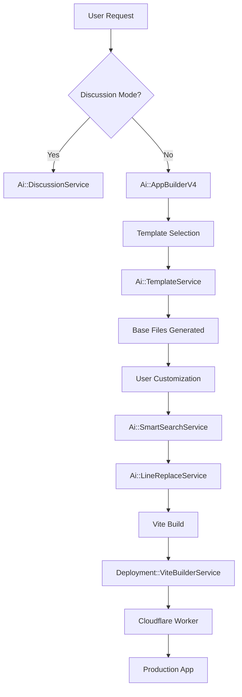

# OverSkill Builder V4: Comprehensive Architecture Plan

## Executive Summary

**Current Problem**: We've diverged from core requirements. Using CDN React + Babel (no build) when we need Vite builds. Missing structured templates, proper file organization, and key service integrations. GPT-5 implementation created complexity without addressing fundamentals.

**Solution**: Builder V4 refocuses on Lovable.dev patterns with Vite builds, React Router, structured templates, and integrated services. Claude 4.1 as primary model with proper tool integration.

---

## 🎯 Core Requirements (Getting Back on Track)

### ⚠️ **Critical Update: Remove INSTANT MODE**
The AI_APP_STANDARDS.md file currently has two modes (INSTANT and PRO) which is causing confusion. **INSTANT MODE (CDN React) should be removed entirely**. We should only use **PRO MODE** (Vite builds) going forward.

### 1. **Vite Build System** (PRO MODE ONLY)
```json
{
  "build": "vite build",
  "dev": "vite dev",
  "preview": "vite preview"
}
```

### 2. **React Router with Proper Structure**
```
src/
├── pages/                      # Route components
│   ├── auth/
│   │   ├── Login.tsx
│   │   ├── SignUp.tsx
│   │   ├── ForgotPassword.tsx
│   │   └── AuthCallback.tsx
│   ├── Dashboard.tsx
│   └── Home.tsx
├── components/                 # Reusable components
│   ├── auth/
│   │   ├── AuthForm.tsx
│   │   ├── SocialButtons.tsx
│   │   └── ProtectedRoute.tsx
│   └── layout/
│       ├── Header.tsx
│       └── Layout.tsx
├── lib/                       # Utilities
│   ├── supabase.ts
│   └── router.tsx
├── hooks/                     # Custom hooks
│   ├── useAuth.ts
│   └── useSupabase.ts
├── App.tsx                    # Router setup
├── main.tsx                   # Entry point
└── vite.config.ts            # Build config
```

### 3. **Shared Core Files (NOT App Templates)**
All apps start with shared foundation files (auth pages, routing, Supabase setup). 
App-specific templates come from cloning existing apps, not pre-built templates.

### 4. **Cloudflare Worker Deployment**
Proper build → deploy pipeline with secret management via API.

### 5. **Supabase Multi-tenancy**
Sharding with RLS for app isolation in shared projects.

---

## 🔴 What Went Wrong (Analysis)

### Current Issues
1. **No Build Step**: Using CDN React + Babel transformation (slow, limited)
2. **No Templates**: Every app starts from scratch
3. **Services Not Used**: LineReplaceService, SmartSearchService built but ignored
4. **Wrong Focus**: GPT-5 batch generation instead of conversation loop
5. **Missing Structure**: No pages/components organization
6. **No Discussion Mode**: Always jumps to code generation

### Root Cause
1. **Dual Mode Confusion**: AI_APP_STANDARDS.md has INSTANT MODE (CDN) and PRO MODE (Vite), causing mixed approaches
2. **GPT-5 Focus**: Prioritized batch generation over proper architecture
3. **Wrong Default**: INSTANT MODE is default when PRO MODE should be the only option

---

## 🚀 Builder V4 Architecture

### System Overview


### Core Services

#### 1. **Ai::AppBuilderV4** (New Orchestrator)
```ruby
module Ai
  class AppBuilderV4
    # Primary orchestrator replacing V3
    # Focus: Template-based generation with smart edits
    
    SUPPORTED_MODELS = [
      'claude-opus-4-1-20250805',      # Primary (extended thinking)
      'claude-sonnet-4-20250514',      # Coding specialist
      'gpt-5'                          # Fallback for batch operations
    ]
    
    def execute!
      # SIMPLIFIED: All apps use same simple architecture
      
      # Phase 1: Generate shared foundation with app-scoped DB
      generate_shared_foundation  # Auth, routing, app-scoped Supabase
      
      # Phase 2: AI generates app-specific features
      generate_app_features        # Simple Supabase-first approach
      
      # Phase 3: Smart customization
      apply_customizations         # Use LineReplace for edits
      
      # Phase 4: Build and deploy
      build_and_deploy            # Fast dev mode or optimized prod
  end
end
```

#### 2. **Ai::SharedTemplateService** (New)
```ruby
module Ai
  class SharedTemplateService
    # NOT for app types - for SHARED COMPONENTS all apps need
    
    CORE_TEMPLATES = {
      auth: {
        'pages/auth/Login.tsx',
        'pages/auth/SignUp.tsx', 
        'pages/auth/ForgotPassword.tsx',
        'pages/auth/UpdatePassword.tsx',
        'pages/auth/AuthCallback.tsx'
      },
      layout: {
        'components/layout/Header.tsx',
        'components/layout/Footer.tsx',
        'components/layout/Layout.tsx'
      },
      lib: {
        'lib/supabase.ts',
        'lib/router.tsx',
        'lib/utils.ts'
      },
      hooks: {
        'hooks/useAuth.ts',
        'hooks/useSupabase.ts',
        'hooks/useToast.ts'
      },
      config: {
        'vite.config.ts',
        'tsconfig.json',
        'tailwind.config.js',
        'package.json'
      }
    }
    
    def generate_core_files(app)
      # Add ONLY the shared foundation files
      # NOT app-specific functionality
      # Users will clone existing apps for specific use cases
    end
  end
end
```

#### App Cloning for Use Cases (Separate System)
```ruby
# Different feature - not templates
class AppCloningService
  # Users browse existing apps
  # Clone one as starting point
  # Examples:
  # - Clone a todo app to start a task manager
  # - Clone a dashboard to start analytics tool
  # - Clone a game to start different game
end
```

#### 3. **Simplified Architecture** (All Apps = Simple)
```ruby
# REMOVED: AppTypeDetector - treating all apps as simple
# Benefits:
# - Consistent architecture across all apps
# - Simpler development and debugging
# - Lower costs (Supabase-first approach)
# - Faster implementation (one path to optimize)

module Ai
  class AppBuilderV4
    # All apps use Simple App architecture:
    # - Supabase Auth for authentication
    # - App-scoped Supabase database
    # - R2 for static assets only
    # - No KV, no Cache API, no complex edge services
    
    ARCHITECTURE = :simple_app_only
  end
end
```

#### 4. **Deployment::ViteBuilderService** (Enhanced with Optimization)
```ruby
module Deployment
  class ViteBuilderService
    def build!(app, mode = :development)
      case mode
      when :development, :preview
        FastDevelopmentBuilder.new(app).build!  # 45s builds
      when :production
        ProductionOptimizedBuilder.new(app).build!  # 3min optimized
      end
    end
  end
  
  class FastDevelopmentBuilder
    # Skip optimization for rapid iteration
    def build!(app)
      vite_result = run_vite_build_fast(app)
      validate_basic_size(vite_result)  # Fail if > 1.2MB
      worker = generate_simple_worker(vite_result)
      deploy_to_preview(worker)
      # Total: 35-45 seconds
    end
  end
  
  class ProductionOptimizedBuilder  
    # Full optimization with hybrid assets
    def build!(app)
      vite_result = run_vite_build_production(app)
      distribution = CloudflareWorkerOptimizer.new.optimize(vite_result)
      upload_to_r2(distribution[:r2_assets])
      worker = generate_hybrid_worker(distribution)
      deploy_to_production(worker)
      # Total: 2.5-3 minutes
    end
  end
end
```

#### 5. **Deployment::CloudflareWorkerOptimizer** (New)
```ruby
module Deployment
  class CloudflareWorkerOptimizer
    MAX_WORKER_SIZE = 900_000  # Leave buffer under 1MB limit
    
    def optimize(vite_build)
      assets = analyze_build_assets(vite_build)
      
      # Separate critical (embed) vs large (R2)
      critical = assets.select { |a| critical_path?(a) }
      r2_assets = assets.reject { |a| critical_path?(a) }
      
      # Upload R2 assets via Cloudflare API (no Wrangler CLI)
      upload_assets_to_r2_via_api(r2_assets)
      
      {
        embedded_assets: critical,
        r2_assets: r2_assets,
        total_embedded_size: calculate_size(critical)
      }
    end
    
    private
    
    def critical_path?(asset)
      # Only embed essential assets for first paint
      asset.path.match?(/\.(css|js)$/) && asset.size < 50_000
    end
    
    def upload_assets_to_r2_via_api(assets)
      # Use Cloudflare R2 API directly - no wrangler CLI needed
      assets.each do |asset|
        CloudflareApiClient.upload_to_r2(
          bucket: ENV['CLOUDFLARE_R2_BUCKET'],
          key: "apps/#{@app.id}/#{asset.path}",
          content: asset.content,
          content_type: asset.mime_type
        )
      end
    end
  end
end
```

#### 6. **Deployment::CloudflareApiClient** (New - No Wrangler CLI)
```ruby
module Deployment
  class CloudflareApiClient
    include HTTParty
    base_uri 'https://api.cloudflare.com/client/v4'
    
    def initialize
      @account_id = ENV['CLOUDFLARE_ACCOUNT_ID']
      @api_token = ENV['CLOUDFLARE_API_TOKEN']
      
      self.class.headers 'Authorization' => "Bearer #{@api_token}"
    end
    
    # Deploy Worker via API (no wrangler CLI)
    def deploy_worker(name, script_content)
      response = self.class.put(
        "/accounts/#{@account_id}/workers/scripts/#{name}",
        headers: { 'Content-Type' => 'application/javascript' },
        body: script_content
      )
      
      raise "Worker deployment failed: #{response.body}" unless response.success?
      response
    end
    
    # Upload to R2 via API (no wrangler CLI)
    def upload_to_r2(bucket:, key:, content:, content_type:)
      # Use R2 API endpoint directly
      r2_endpoint = "https://#{@account_id}.r2.cloudflarestorage.com/#{bucket}/#{key}"
      
      response = HTTParty.put(r2_endpoint, {
        headers: {
          'Authorization' => "Bearer #{@api_token}",
          'Content-Type' => content_type
        },
        body: content
      })
      
      raise "R2 upload failed: #{response.body}" unless response.success?
      response
    end
    
    # Set Worker secrets via API (no wrangler CLI)
    def set_worker_secrets(worker_name, secrets_hash)
      secrets_hash.each do |key, value|
        response = self.class.patch(
          "/accounts/#{@account_id}/workers/scripts/#{worker_name}/secrets",
          body: { name: key, text: value, type: 'secret_text' }.to_json,
          headers: { 'Content-Type' => 'application/json' }
        )
        
        raise "Secret setting failed for #{key}" unless response.success?
      end
    end
    
    # Configure Worker routes via API (no wrangler CLI)
    def configure_worker_routes(worker_name, domains)
      domains.each do |domain|
        response = self.class.post(
          "/zones/#{ENV['CLOUDFLARE_ZONE_ID']}/workers/routes",
          body: {
            pattern: "#{domain}/*",
            script: worker_name
          }.to_json,
          headers: { 'Content-Type' => 'application/json' }
        )
        
        raise "Route configuration failed for #{domain}" unless response.success?
      end
    end
  end
end
```

#### 7. **Ai::DiscussionService** (New)
```ruby
module Ai
  class DiscussionService
    # Default mode - discuss before coding
    
    def should_discuss?(message)
      # Default to true unless explicit action words
      return false if message.match?(/\b(create|build|generate|implement|add|fix)\b/i)
      return false if message.match?(/\bcode\b.*\b(this|that|it)\b/i)
      true
    end
    
    def discuss(app, message)
      # Architecture discussion
      # Requirements clarification
      # Technology choices
      # No code generation
    end
  end
end
```

### Tool Integration Strategy

#### Phase 1: Smart Search & Replace
```ruby
# INTEGRATE EXISTING SERVICES
def apply_customizations
  # Use SmartSearchService to find components
  search = Ai::SmartSearchService.new(@app)
  existing = search.search_components(component_name)
  
  if existing.any?
    # Use LineReplaceService for surgical edits
    Ai::LineReplaceService.replace_lines(
      file: existing.first,
      search_pattern: pattern,
      replacement: new_code
    )
  else
    # Create new file from template
    create_from_template
  end
end
```

#### Phase 2: Conversation Loop for Claude
```ruby
def generate_with_claude
  # Claude only creates 1-2 files per call
  # Need conversation loop
  
  files_needed = plan_files_needed
  files_created = []
  
  files_needed.each_slice(2) do |batch|
    response = claude_create_files(batch)
    files_created.concat(response[:files])
    
    # Real-time broadcast
    broadcast_progress(files_created)
  end
end
```

---

## 📁 Standard App Structure (All Apps)

### NEW: Critical Enhancements from Analysis

#### 1. **Cloudflare Worker Size Management** (CRITICAL)
- Automatic hybrid asset strategy (embed critical, R2 for large)
- 1MB worker limit handled transparently
- Fast dev builds (45s) vs optimized prod builds (3min)

#### 2. **App-Scoped Database** (CRITICAL)
```typescript
// ALL apps get this wrapper (transparent + debuggable)
class AppScopedDatabase {
  from(table: string) {
    const scopedTable = `app_${this.appId}_${table}`;
    // Logs in dev: "Querying table: app_123_todos"
    return this.supabase.from(scopedTable);
  }
  
  getTableName(table: string): string {
    return `app_${this.appId}_${table}`;
  }
}
```

#### 3. **Consistent Simple Architecture**
- **ALL apps**: Supabase-first, minimal edge complexity
- **Authentication**: Supabase Auth (built-in OAuth, session management)
- **Database**: App-scoped Supabase tables with RLS isolation
- **Static Assets**: R2 for CDN performance only
- **No KV Storage**: No complex edge services or caching layers

### Base Template Files (Updated)
```
overskill-app-template/
├── src/
│   ├── pages/
│   │   ├── auth/
│   │   │   ├── Login.tsx           # Email + social login
│   │   │   ├── SignUp.tsx          # Registration with validation
│   │   │   ├── ForgotPassword.tsx  # Password reset flow
│   │   │   └── AuthCallback.tsx    # OAuth redirect handler
│   │   ├── Dashboard.tsx            # Protected main app
│   │   ├── Settings.tsx             # User preferences
│   │   └── Home.tsx                # Public landing
│   ├── components/
│   │   ├── auth/
│   │   │   ├── AuthForm.tsx        # Reusable form wrapper
│   │   │   ├── SocialButtons.tsx   # OAuth providers
│   │   │   └── ProtectedRoute.tsx  # Route guard HOC
│   │   ├── layout/
│   │   │   ├── Header.tsx          # Nav with auth state
│   │   │   ├── Footer.tsx          # App footer
│   │   │   └── Layout.tsx          # Main wrapper
│   │   └── ui/                     # shadcn/ui components
│   │       ├── button.tsx
│   │       ├── input.tsx
│   │       └── [30+ components]
│   ├── lib/
│   │   ├── supabase.ts             # Client initialization
│   │   ├── api.ts                  # API helpers
│   │   └── utils.ts                # Utilities
│   ├── hooks/
│   │   ├── useAuth.ts              # Auth state management
│   │   ├── useSupabase.ts          # Database hooks
│   │   └── useToast.ts             # Notifications
│   ├── styles/
│   │   └── globals.css             # Tailwind imports
│   ├── App.tsx                     # Router configuration
│   ├── main.tsx                    # React entry point
│   └── vite-env.d.ts              # TypeScript definitions
├── public/
│   └── [assets]
├── .env.example                    # Environment template
├── .gitignore
├── index.html                      # Vite entry
├── package.json                    # Dependencies
├── tailwind.config.js              # Tailwind setup
├── tsconfig.json                   # TypeScript config
└── vite.config.ts                  # Build configuration
```

### Standard Dependencies
```json
{
  "dependencies": {
    "react": "^18.3.1",
    "react-dom": "^18.3.1",
    "react-router-dom": "^6.22.0",
    "@supabase/supabase-js": "^2.39.7",
    "@tanstack/react-query": "^5.24.1",
    "lucide-react": "^0.344.0",
    "clsx": "^2.1.0",
    "tailwind-merge": "^2.2.1"
  },
  "devDependencies": {
    "@vitejs/plugin-react": "^4.2.1",
    "vite": "^5.1.4",
    "typescript": "^5.3.3",
    "tailwindcss": "^3.4.1",
    "autoprefixer": "^10.4.17",
    "@types/react": "^18.2.56"
  }
}
```

---

## 🔧 Implementation Phases

### Phase 1: Core Infrastructure (Week 1)
1. **Create Ai::AppBuilderV4**
   - Replace V3 orchestrator
   - Integrate existing services
   - Implement discussion mode

2. **Build Ai::SharedTemplateService**
   - Create shared foundation files (auth, routing, config)
   - NOT app-specific templates
   - Focus on reusable components

3. **Implement Deployment::ViteBuilderService**
   - Vite build pipeline
   - Cloudflare Worker generation
   - Secret management

### Phase 2: Service Integration (Week 1)
1. **Integrate LineReplaceService**
   - Tool definition in V4
   - Surgical edit workflow
   - Token optimization

2. **Integrate SmartSearchService**
   - Component discovery
   - Duplicate prevention
   - Context loading

3. **Implement Conversation Loop**
   - Claude 4 multi-step
   - Progress broadcasting
   - File batching

### Phase 3: App Library & Cloning (Week 2)
1. **Build Example Apps for Cloning**
   - Todo app (basic CRUD)
   - Dashboard (data viz)
   - Blog (content management)
   - Game (state management)
   - Tool (single purpose)
   
2. **Implement App Cloning Service**
   - Browse existing apps
   - Clone as starting point
   - Maintain app genealogy

3. **Supabase Integration**
   - RLS policies
   - Multi-tenancy
   - Auth flows

4. **Testing & Validation**
   - Shared file generation
   - Build process
   - Deployment

---

## 🗑️ Files to Deprecate/Remove

### Update Immediately
```
# Remove INSTANT MODE, keep only PRO MODE
/AI_APP_STANDARDS.md  # Remove INSTANT MODE section, focus on Vite/TypeScript only
```

### Remove Immediately
```
# Test files (already cleaned)
/test_*.rb
/debug_*.rb
/check_*.rb

# Old orchestrators
/app/services/ai/app_update_orchestrator.rb  # V1
/app/services/ai/app_update_orchestrator_v2.rb  # V2

# CDN React services (INSTANT MODE)
/app/services/deployment/fast_preview_service.rb  # CDN approach - remove
/app/services/deployment/cloudflare_preview_service.rb  # Non-build approach

# Obsolete docs
/docs/test_*.md
/docs/phase1-*.md  # Old implementation
/docs/phase2-*.md
/docs/phase3-*.md
/docs/comprehensive-app-generation-flow-analysis.md  # Outdated analysis
```

### Deprecate (Keep for reference)
```
# V3 orchestrator - deprecate after V4 stable
/app/services/ai/app_update_orchestrator_v3_unified.rb

# Keep for migration reference
/CLAUDE.md  # Update to remove INSTANT MODE references
```

---

## 🎯 Success Metrics

### Technical Metrics
- **Dev Build Time**: < 45 seconds (fast mode)
- **Prod Build Time**: < 3 minutes (optimized)
- **Worker Script Size**: < 900KB (with buffer)
- **Cold Start Time**: < 100ms for edge workers
- **Database Query**: < 50ms with app scoping
- **Token Savings**: 90% via LineReplaceService
- **Code Quality**: TypeScript + ESLint passing

### Cloudflare-Specific Metrics
- **Worker Size Compliance**: 100% under 1MB limit
- **R2 Asset Load**: < 200ms for non-critical
- **RLS Policy Coverage**: 100% app-scoped tables
- **Edge Optimization**: Cache API for performance apps

### Business Metrics
- **Time to First App**: < 60 seconds
- **App Success Rate**: > 95% working apps  
- **App Cost**: $1-2/month per app (consistent simple architecture)
- **Cost Efficiency**: 90% AI savings maintained
- **Deployment**: 100% API-driven (no CLI dependencies)

---

## 🔄 Migration Strategy

### Step 1: Parallel Development
- Build V4 alongside V3
- Test with subset of users
- Validate template approach

### Step 2: Gradual Rollout
- New apps use V4
- Existing apps stay on V3
- Monitor performance

### Step 3: Full Migration
- Migrate V3 apps to V4
- Deprecate old services
- Remove CDN approach

---

## 📊 Competitive Analysis (V4 vs Lovable)

| Feature | OverSkill V4 | Lovable | Advantage |
|---------|--------------|---------|-----------|
| **Build System** | Vite | Vite | Equal |
| **Architecture** | Simple & Consistent | Variable complexity | OverSkill |
| **Shared Foundation** | Pre-built auth/routing | Generated each time | OverSkill |
| **App Cloning** | Clone existing apps | Unknown | OverSkill |
| **Database Isolation** | App-scoped + RLS | Manual setup | OverSkill |
| **Discussion Mode** | Default | Default | Equal |
| **Surgical Edits** | LineReplace | line-replace | Equal |
| **Search** | SmartSearch | search-files | Equal |
| **Deployment** | API-only, no CLI | Wrangler CLI | OverSkill |
| **Multi-tenancy** | Automatic app scoping | Manual | OverSkill |
| **Cost** | $1-2/month per app | Unknown | OverSkill |

---

## 🚀 Next Steps

### Immediate Actions (Today)
1. Review and approve this plan
2. Create Ai::AppBuilderV4 skeleton
3. Start Ai::TemplateService implementation
4. Set up Vite build pipeline

### Week 1 Deliverables
1. Working V4 orchestrator
2. Shared foundation files (auth, routing, config)
3. Vite builds working
4. Cloudflare deployment

### Week 2 Deliverables
1. Example apps for cloning (todo, dashboard, etc.)
2. App cloning service
3. Full service integration
4. Testing suite
5. Production ready

---

## 💡 Key Innovations

### 1. **Shared Foundation Approach**
Instead of generating auth/routing from scratch every time, use shared foundation files that all apps need. App-specific features come from AI generation or cloning existing apps.

### 2. **Smart Edits Only**
Use existing services to make surgical changes, not rewrite files.

### 3. **Conversation-Aware**
Default to discussion, only code when explicitly requested.

### 4. **Build-Deploy Pipeline**
Proper Vite builds with optimized production deployment.

### 5. **Multi-tenant by Default**
Every app isolated via Supabase RLS from day one.

---

## 📝 Configuration Requirements

### Environment Variables
```env
# AI Models
ANTHROPIC_API_KEY=
OPENAI_API_KEY=

# Supabase (per shard)
SUPABASE_URL=
SUPABASE_ANON_KEY=
SUPABASE_SERVICE_KEY=

# Cloudflare
CLOUDFLARE_API_TOKEN=
CLOUDFLARE_ACCOUNT_ID=
CLOUDFLARE_ZONE_ID=

# Build
NODE_ENV=production
VITE_BUILD_PATH=/tmp/builds
```

### Required Services
- Redis (caching)
- PostgreSQL (app data)
- Supabase (auth + database)
- Cloudflare (deployment)
- Node.js (builds)

---

## 🎉 Conclusion

Builder V4 represents a **return to fundamentals** with proper architecture:

1. **Vite builds** instead of CDN React
2. **Structured templates** with pages/components
3. **Integrated services** (LineReplace, SmartSearch)
4. **Discussion-first** approach
5. **Production deployment** with Cloudflare Workers

This plan addresses all current gaps while maintaining our competitive advantages in cost (90% savings) and deployment capabilities.

**The result**: A Lovable-quality development experience with OverSkill's unique strengths.

---

## 📅 Timeline

| Week | Focus | Deliverables |
|------|-------|-------------|
| 1 | Infrastructure | V4 orchestrator, templates, Vite builds |
| 2 | Integration | All services connected, testing complete |
| 3 | Polish | Documentation, migration tools |
| 4 | Launch | Production rollout, monitoring |

---

## 🔴 CRITICAL NEXT STEPS

### 1. **Update AI_APP_STANDARDS.md** (IMMEDIATE)
```markdown
# Remove entire INSTANT MODE section
# Keep only PRO MODE with:
- TypeScript required
- Vite build system
- React Router structure
- pages/components organization
- Proper build → deploy pipeline
```

### 2. **Create Ai::AppBuilderV4** (Day 1)
```ruby
# New orchestrator that:
- Uses templates as base
- Integrates LineReplaceService
- Integrates SmartSearchService  
- Implements discussion mode
- Supports conversation loop for Claude
```

### 3. **Build Shared Foundation System** (Week 1)
```
# Create shared core files all apps need:
- Auth pages (Login, SignUp, ForgotPassword, etc.)
- Router configuration
- Supabase client setup
- Layout components (Header, Footer)
- Config files (Vite, TypeScript, Tailwind)

# App-specific functionality comes from:
- AI generation based on requirements
- Users cloning existing apps as starting points
```

### 4. **Implement Vite Build Pipeline** (Week 1)
```ruby
# ViteBuilderService that:
- Runs npm install
- Runs vite build
- Generates Worker wrapper
- Deploys to Cloudflare
```

---

## 📋 Review Checklist

✅ **Problem Identified**: INSTANT MODE (CDN) vs PRO MODE (Vite) confusion
✅ **Solution Defined**: V4 with PRO MODE only, proper templates
✅ **Services Located**: LineReplaceService and SmartSearchService ready for integration
✅ **Architecture Planned**: pages/components structure with React Router
✅ **Deployment Strategy**: Vite build → Cloudflare Worker
✅ **Migration Path**: Clear deprecation and update plan

---

*Document Created: August 11, 2025*
*OverSkill Builder V4 - Back on Track Edition*

**Ready for Review and Implementation**