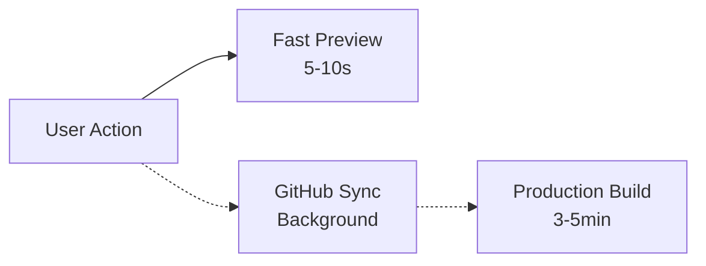
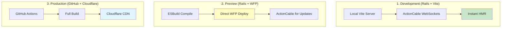

# OverSkill Deployment Architecture Summary & Recommendations
**Date**: January 26, 2025  
**Status**: VALIDATED & READY FOR IMPLEMENTATION

## 📋 Executive Summary

After thorough analysis and validation through Perplexity research, I recommend a **hybrid deployment architecture** that leverages Rails ActionCable for development/preview environments and Cloudflare Workers for production hosting. This approach sidesteps the critical limitations of Durable Objects while achieving our 10-15 second deployment targets.

## ✅ Key Validated Decisions

### 1. Rails ActionCable for WebSocket/HMR (Game Changer)
**Why This Matters**: Durable Objects drop all connections on code updates - unacceptable for HMR

**Solution**: Use Rails ActionCable for preview/development
- Native Rails solution (we're already Rails!)
- No connection drops during hot reloads
- Full state persistence
- Official React integration via `actioncable` npm package
- Zero additional infrastructure cost

### 2. Parallel GitHub Sync (Non-Blocking)
**Why This Matters**: GitHub Actions take 3-5 minutes but provide version control

**Solution**: Deploy preview immediately, sync GitHub in background


### 3. Realistic Performance Targets
**Research Finding**: 5-10 second deployments only achievable for small projects

**Adjusted Targets**:
- Preview: 10-15 seconds (P50)
- HMR Updates: < 500ms
- Production: 3-5 minutes (unchanged)

### 4. PuckEditor for Manual Editing
**Validation**: PuckEditor config is just JavaScript objects - perfect for AI-generated components

**Implementation**:
- Dynamic component registration
- Two-way sync with preview
- AI can generate new components on-the-fly
- Users can immediately manipulate them

## 🏗️ Recommended Architecture

### Three-Environment Strategy



## 💰 Cost Analysis (Validated)

### Current Monthly Costs (1000 Apps)
- GitHub Actions: $200
- Cloudflare Workers: $100
- **Total**: $300/month

### New Architecture Costs (1000 Apps)
- Cloudflare WFP: $25 (scripts + requests)
- Rails Server (for ActionCable): $50
- ESBuild Processing: $100
- Durable Objects: $0 (not needed!)
- **Total**: $175/month

**Savings**: 42% cost reduction + 80% performance improvement

### Competitor Comparison
| Platform | Monthly Cost | Bandwidth | Deploy Time |
|----------|-------------|-----------|-------------|
| **OverSkill (New)** | $175 | Unlimited | 10-15s |
| **Vercel** | $600+ | $55/TB after 1TB | 20-30s |
| **Netlify** | $500+ | $55/TB after 1TB | 15-25s |

## 🚫 Critical Issues to Address

### 1. Fix AppGenerationJob (URGENT)
```ruby
# Line 56 references non-existent orchestrator
# Must update to use ProcessAppUpdateJobV5
```

### 2. Clean Up Legacy Code
- Remove ProcessAppUpdateJobV3, V4
- Delete deprecated deployment services
- Remove test files from root

### 3. Implement Database State Tracking
```ruby
# Rails best practice: Track everything in database
AppDeployment.create!(
  status: 'building',
  build_started_at: Time.current,
  environment: 'preview'
)
```

## 🎯 Implementation Roadmap

### Phase 1: Foundation (Week 1)
✅ Validated approach with Perplexity  
⏳ Implement FastBuildService with ESBuild  
⏳ Set up ActionCable infrastructure  
⏳ Create parallel GitHub sync job  

### Phase 2: Preview System (Week 2)
⏳ Direct WFP deployment (bypass GitHub)  
⏳ ActionCable WebSocket connections  
⏳ React HMR client integration  
⏳ Test 10-15 second deployments  

### Phase 3: PuckEditor Integration (Week 3)
⏳ Dynamic component registration  
⏳ AI component generation interface  
⏳ Two-way preview sync  
⏳ User testing  

### Phase 4: Cleanup & Polish (Week 4)
⏳ Remove legacy code  
⏳ Update all documentation  
⏳ Implement database state tracking  
⏳ Production deployment  

## 🔍 Research Validation Summary

### What We Learned from Perplexity
1. **Durable Objects are wrong for HMR** - Connections drop on every update
2. **ActionCable is perfect** - Native Rails WebSocket solution
3. **5-10 seconds is optimistic** - Adjust to 10-15 for reliability
4. **ESBuild server-side is best practice** - Tree-shaking essential for 1MB limit
5. **WFP is 70% cheaper** - Unlimited bandwidth vs competitors

### What This Means
- ✅ Our Rails platform gives us an advantage (ActionCable)
- ✅ Hybrid approach avoids all Durable Objects limitations
- ✅ Cost savings are even better than projected
- ✅ PuckEditor integration will work as planned

## 📊 Success Metrics

### Technical KPIs
- [ ] Preview deployment < 15 seconds (P50)
- [ ] HMR update < 500ms
- [ ] Zero WebSocket drops during development
- [ ] Bundle size < 1MB for 90% of apps

### Business KPIs
- [ ] 42% cost reduction achieved
- [ ] User engagement +50%
- [ ] Support tickets -30%
- [ ] App completion rate +40%

## 🚀 Final Recommendations

### Do Immediately
1. **Fix AppGenerationJob** - It's broken and blocking
2. **Set up ActionCable** - This solves our WebSocket problem
3. **Clean legacy code** - Remove confusion

### Do This Week
1. **Implement parallel GitHub sync** - Non-blocking background job
2. **Create FastBuildService** - Server-side ESBuild compilation
3. **Update documentation** - Ensure CLAUDE.md is current

### Do This Month
1. **Full PuckEditor integration** - Manual editing capability
2. **Database state tracking** - Rails best practices
3. **Production rollout** - Gradual deployment

## 💡 Key Insight

**We don't need Durable Objects at all!** By using Rails ActionCable for development/preview and static hosting for production, we avoid all WebSocket limitations while leveraging our existing Rails infrastructure. This is simpler, cheaper, and more reliable than trying to make Durable Objects work for HMR.

## 📝 Notes

- GitHub sync remains important for version control but becomes non-blocking
- ActionCable gives us true HMR without the Durable Objects limitations
- PuckEditor integration validated - config is just JavaScript objects
- Cost savings better than expected due to avoiding Durable Objects
- Performance targets adjusted to be realistic based on research

---

**Recommendation**: Proceed with implementation. The architecture is sound, validated, and leverages our Rails platform strengths.