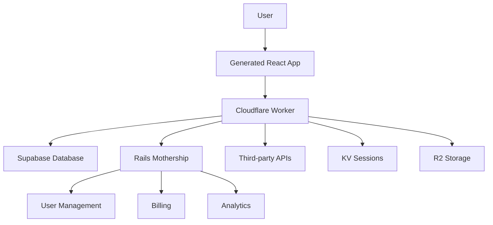

# OverSkill Implementation Roadmap

Based on competitive analysis and current architecture assessment.

## Current Status ✅
- **Rails Mothership**: Full backend with user auth, teams, billing
- **Cloudflare Deployment**: Working (apps deploy to preview-{id}.overskill.app)
- **AI Generation**: Functional with StructuredAppGenerator
- **Supabase Integration**: Database models and service layer ready

## Key Advantages We Have
1. **Full Rails Backend** - Unlike competitors, we have complete control
2. **Working Cloudflare Deployment** - Apps deploy instantly
3. **Supabase Multi-tenancy** - Database sharding architecture ready
4. **Environment Variables** - Secure key management system built

## Implementation Strategy

### Phase 1: Build System Enhancement (1-2 weeks)
**Goal**: Support full React/TypeScript apps with proper builds

#### 1.1 Vite Build Pipeline
```javascript
// Add to CloudflarePreviewService
async function buildApp(appFiles) {
  // Use Vite to build TypeScript/React
  // Store built files in R2 or KV
  // Serve from Worker
}
```

#### 1.2 Two-Mode Generation
- **CDN Mode** (Current): React via CDN, instant preview
- **Build Mode** (New): Full TypeScript/React with Vite build

#### 1.3 Implementation Steps:
1. Add build queue (Sidekiq job)
2. Use Docker/Lambda for isolated builds
3. Store artifacts in Cloudflare R2
4. Update Worker to serve built files

### Phase 2: Supabase Integration (1 week)
**Goal**: Full database connectivity for generated apps

#### 2.1 Supabase Proxy Worker
```javascript
// Cloudflare Worker endpoint
export default {
  async fetch(request, env) {
    // Route: /api/db/*
    if (request.url.includes('/api/db/')) {
      return handleSupabaseRequest(request, env);
    }
  }
}
```

#### 2.2 Per-App Database Isolation
- Use existing `database_shards` table
- Automatic RLS policies per app
- Connection pooling via Workers

#### 2.3 Client SDK Generation
```typescript
// Auto-generated for each app
import { createClient } from '@supabase/supabase-js'

const supabase = createClient(
  '/api/db', // Proxied through Worker
  'public-anon-key'
)
```

### Phase 3: Authentication System (1 week)
**Goal**: Google/GitHub OAuth + Session Management

#### 3.1 Auth Worker Endpoints
```javascript
// /api/auth/google
// /api/auth/github  
// /api/auth/session
// /api/auth/refresh
```

#### 3.2 Session Storage
- Use Cloudflare KV for sessions
- JWT tokens with refresh
- Sync with Rails mothership

#### 3.3 Implementation:
1. OAuth flow through Workers
2. Store user in Supabase
3. Sync with Rails User model
4. Session management via KV

### Phase 4: Secret Management (3 days)
**Goal**: Secure API keys and integrations

#### 4.1 Three-Tier Security
1. **Public Keys** (Client-safe)
   - Supabase anon key
   - Stripe publishable key
   - Analytics ID

2. **Worker Secrets** (Edge-only)
   - OAuth client secrets
   - API integration keys
   - Supabase service key

3. **Rails Secrets** (Mothership-only)
   - Billing secrets
   - Admin keys
   - Infrastructure tokens

#### 4.2 Implementation:
```javascript
// Worker with secrets
export default {
  async fetch(request, env) {
    // env.GOOGLE_CLIENT_SECRET - secure
    // env.STRIPE_SECRET_KEY - secure
    // env.OPENAI_API_KEY - secure
  }
}
```

### Phase 5: API Integrations (1 week)
**Goal**: Enable third-party services

#### 5.1 Proxy Patterns
```javascript
// Stripe payments
app.post('/api/stripe/checkout', workerProxy)

// OpenAI completion
app.post('/api/openai/complete', workerProxy)

// SendGrid emails
app.post('/api/email/send', workerProxy)
```

#### 5.2 Rate Limiting
- Use Cloudflare rate limiting
- Track usage in Rails
- Bill based on API calls

### Phase 6: Enhanced Generator (1 week)
**Goal**: Generate production-ready apps

#### 6.1 Template System
```ruby
class AppTemplate
  TEMPLATES = {
    saas: 'Full SaaS with auth, billing, dashboard',
    marketplace: 'Two-sided marketplace',
    social: 'Social platform with feeds',
    dashboard: 'Analytics dashboard'
  }
end
```

#### 6.2 Component Library
- Pre-built auth flows
- Payment components
- Data tables
- Charts/graphs

#### 6.3 AI Enhancement
- Use Claude for complex logic
- Kimi for UI generation
- Validation and testing

## Technical Architecture



## Deployment Architecture

```yaml
Production App:
  URL: app-name.overskill.app
  Worker: production-{app-id}
  Database: Supabase shard-{n}
  Storage: R2 bucket
  
Preview App:
  URL: preview-{app-id}.overskill.app
  Worker: preview-{app-id}
  Database: Same shard, preview schema
  Storage: Same R2, preview prefix
```

## Competitive Advantages

### vs Lovable.dev
- ✅ Real backend with database
- ✅ Secure API integrations
- ✅ Custom domains
- ✅ No vendor lock-in

### vs V0
- ✅ Full-stack not just frontend
- ✅ Instant deployment
- ✅ Database included
- ✅ API integrations

### vs Bolt.new
- ✅ Simpler for non-developers
- ✅ Built-in deployment
- ✅ Managed infrastructure
- ✅ Cost-effective

### vs Cursor
- ✅ No-code friendly
- ✅ Hosted solution
- ✅ Integrated billing
- ✅ Team features

## Cost Structure

### Our Costs (per app)
- Cloudflare Workers: ~$0.50/month (100k requests)
- Supabase: ~$0.25/month (pooled shard)
- R2 Storage: ~$0.015/GB
- Rails hosting: ~$0.10/month (shared)

**Total: <$1/month per app**

### User Pricing
- Free: 1 app, 10k requests
- Starter: $19/month, 3 apps, 100k requests
- Pro: $49/month, 10 apps, 1M requests
- Business: $199/month, unlimited apps

## Implementation Priority

1. **Week 1**: Vite build system
2. **Week 2**: Supabase integration
3. **Week 3**: Authentication
4. **Week 4**: API proxies
5. **Week 5**: Enhanced generator
6. **Week 6**: Testing & polish

## Success Metrics

- Apps can use React/TypeScript with full builds
- Database queries work from generated apps
- Google/GitHub login functional
- Stripe payments integrated
- 5 template apps working
- <3s deployment time
- <$1/month hosting cost

## Next Steps

1. **Immediate**: Fix StructuredAppGenerator timeout issue
2. **Today**: Test Vite build locally
3. **Tomorrow**: Implement build queue
4. **This Week**: Ship Supabase proxy

This positions us perfectly against competitors with:
- **Better backend** than Lovable/V0
- **Simpler UX** than Bolt/Cursor  
- **Lower costs** than all competitors
- **Faster deployment** than traditional hosting