# Tool Streaming Flow Analysis - Current State

## 🔴 CRITICAL ISSUE: Tools Detected But Not Executed

### Current Flow (BROKEN):
```
1. User submits prompt → App created with status="draft" ✅
2. App.after_create callback triggers ProcessAppUpdateJobV5 ✅  
3. AppBuilderV5 uses INCREMENTAL streaming ✅
4. IncrementalToolStreamer detects tools from SSE stream ✅
   - Tool 0: os-line-replace detected ✅
   - Tool 1: os-line-replace detected ✅
   - Tool 2: os-line-replace detected ✅
   - Tool 3: os-line-replace detected ✅
   - Tool 4: os-write detected ✅
   - Tool 5: os-write detected ✅
   - Tool 6: rename-app detected ✅
5. Tools broadcast to UI as "pending" ✅
6. ❌ FAILURE POINT: Tool JSON completion NOT triggering dispatch
7. Stream ends with stop_reason="tool_use" ✅
8. No tools executed, empty results ❌
9. App created but no actual changes made ❌
```

### Expected Flow (SHOULD BE):
```
1. User submits prompt
2. ProcessAppUpdateJobV5 starts
3. IncrementalToolStreamer begins SSE parsing
4. For EACH tool detected:
   a. on_tool_start callback → UI shows "pending"
   b. Tool JSON accumulates in buffer
   c. on_tool_complete callback → Tool dispatched to Sidekiq
   d. StreamingToolExecutionJobV2 executes tool
   e. Tool result stored in Redis
   f. UI updated with "complete" status
5. IncrementalToolCompletionJob monitors completion
6. When all tools done → Continue conversation
7. Final response generated with results
```

## 🔍 Root Cause Analysis

### Evidence from Logs:

1. **Tools ARE being detected** (from log at 17:55:39):
```
[INCREMENTAL_STREAMER] Tool detected: os-line-replace (toolu_013TvsSCQTk4tawT6swsnsFT)
[V5_INCREMENTAL] Tool detected: os-line-replace at index 0
[ActionCable] Broadcasting to chat_progress_3144
```

2. **Tools are NOT completing** (missing from logs):
```
[INCREMENTAL_STREAMER] Tool complete: os-line-replace, dispatching immediately!
[V5_INCREMENTAL] Dispatching tool 0 via coordinator
```

3. **Stream ends without dispatch**:
```
[V5_INCREMENTAL] Stream complete. Stop reason: tool_use
[V5_INCREMENTAL] 0 tools already executing  ← THIS IS THE PROBLEM
```

## 📊 Flow Diagram

```mermaid
graph TD
    A[User Submits Prompt] --> B[ProcessAppUpdateJobV5]
    B --> C{Incremental Streaming?}
    C -->|Yes| D[IncrementalToolStreamer]
    D --> E[SSE Event Stream]
    E --> F[content_block_start]
    F --> G[Tool Detected ✅]
    G --> H[input_json_delta events]
    H --> I[content_block_stop]
    I --> J{Tool JSON Complete?}
    J -->|Should Parse JSON| K[on_tool_complete callback]
    K -->|❌ NOT HAPPENING| L[Dispatch to Sidekiq]
    L --> M[Execute Tool]
    M --> N[Store Result]
    N --> O[Update UI]
    
    style K fill:#ff0000
    style L fill:#ff0000
```



## 🐛 Bug Location

The issue is in `/app/services/ai/incremental_tool_streamer.rb` at line ~245:

```ruby
def handle_content_block_stop(index)
  tool_id = find_tool_id_by_index(index)
  
  if tool_id && @tool_buffers[tool_id]
    tool_data = @tool_buffers[tool_id]
    
    begin
      # Parse the complete tool input
      input_json = JSON.parse(tool_data[:input_json])  # ← MAY BE FAILING SILENTLY
      
      # Build complete tool call
      tool_call = {
        id: tool_data[:id],
        type: "function",
        function: {
          name: tool_data[:name],
          arguments: input_json.to_json
        },
        index: tool_data[:index]
      }
      
      # CRITICAL: This callback MUST fire but isn't
      Rails.logger.info "[INCREMENTAL_STREAMER] Tool complete: #{tool_data[:name]}, dispatching immediately!"
      @callbacks[:on_tool_complete]&.call(tool_call)  # ← NOT BEING REACHED
```

## 🔧 Fix Required

1. **Add debug logging** to see if JSON parsing is failing
2. **Check if tool_buffers** are being populated correctly  
3. **Verify find_tool_id_by_index** is returning correct ID
4. **Ensure content_block_stop** is being called for tools

## 📈 Impact

- **Current**: 0% of tools executing despite detection
- **Users affected**: All users trying incremental streaming
- **Severity**: CRITICAL - Core functionality broken

## 🎯 Next Steps

1. Add comprehensive logging to `handle_content_block_stop`
2. Check if `input_json` buffer is accumulating properly
3. Verify SSE parsing for `input_json_delta` events
4. Test JSON parsing with actual tool data
5. Ensure callbacks are properly wired up